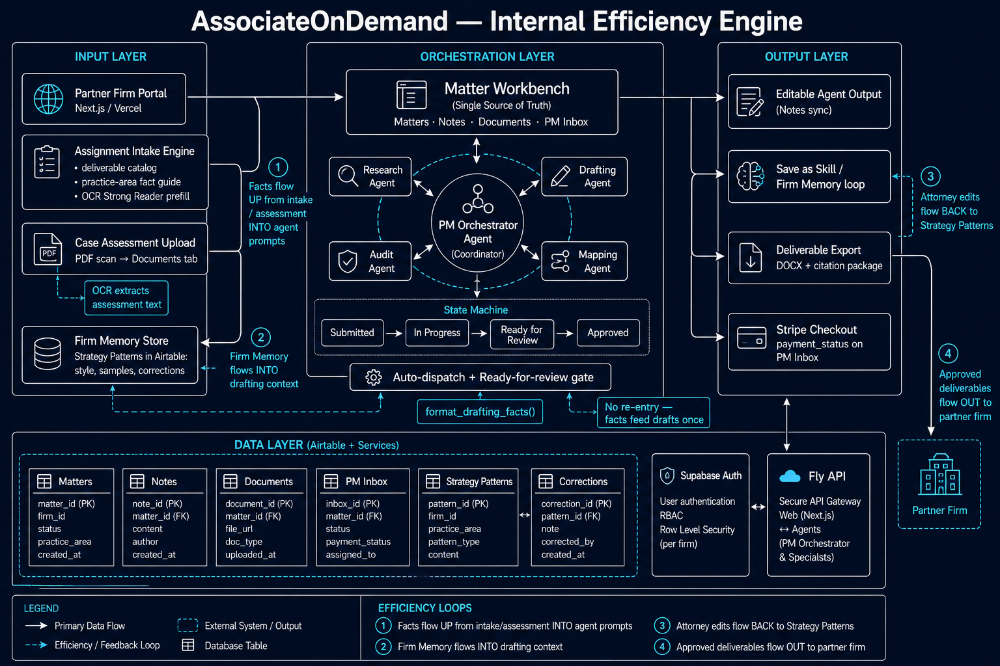
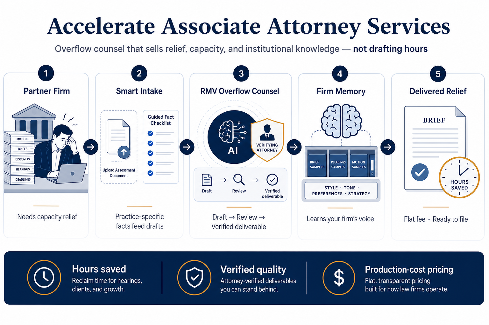

# Architecture diagrams

Visual reference for how AssociateOnDemand works internally and how partner firms experience overflow counsel. Use these when onboarding engineers, aligning product decisions, or explaining the firm OS to stakeholders.

## Internal efficiency system

This diagram shows the **internal engine** RMV uses to turn partner assignments into verified deliverables efficiently.

**What flows in**

- Partner firms submit work through the **Partner Firm Portal** (Next.js on Vercel).
- The **Assignment Intake Engine** collects practice-specific facts, deliverable type, and optional assessment uploads.
- **Case Assessment Upload** runs OCR on PDF scans so assessment text lands on the matter’s Documents tab.
- **Firm Memory** (Strategy Patterns in Airtable) supplies each firm’s style, samples, and past corrections.

**What orchestrates the work**

- The **Matter Workbench** is the single source of truth: matters, notes, documents, and the PM inbox live here.
- A **PM Orchestrator** coordinates specialist agents (Research, Audit, Drafting, Mapping).
- A simple **state machine** moves each matter: Submitted → In Progress → Ready for Review → Approved.
- **Gatekeeping** auto-dispatches work and blocks re-entry: facts feed drafts once via `format_drafting_facts()`.

**What flows out**

- **Editable agent output** attorneys can refine before approval.
- Approved work can be **saved back to Firm Memory** so the system learns the firm’s voice.
- **Deliverable export** produces DOCX plus a citation package.
- **Stripe Checkout** (when configured) records payment status on the PM Inbox.
- Finished deliverables return to the **partner firm**.

**What sits underneath**

- **Airtable** holds Matters, Notes, Documents, PM Inbox, Strategy Patterns, and Corrections.
- **Supabase Auth** provides user login, RBAC, and row-level security per firm.
- **Fly API** is the secure gateway between the web app and agent services.

**Four efficiency loops**

1. Facts flow **up** from intake and assessment into agent prompts.
2. Firm Memory flows **into** drafting context.
3. Attorney edits flow **back** into Strategy Patterns.
4. Approved deliverables flow **out** to the partner firm.

---

## Overflow counsel workflow (partner-facing)

This diagram is the **partner-facing story**: what a solo or small firm buys when they need capacity relief—not raw AI hours.

**The five steps**

1. **Partner firm needs relief** — motions, briefs, discovery, hearings, and deadlines pile up; the firm is out of bandwidth.
2. **Smart intake** — the firm uploads an assessment document and completes a guided, practice-specific fact checklist so drafts start from real case facts, not generic prompts.
3. **RMV overflow counsel** — AI drafts, a verifying attorney reviews, and the firm receives a **verified deliverable** they can stand behind.
4. **Firm Memory learns your voice** — brief, pleading, and motion samples plus style, tone, preferences, and strategy shape future work.
5. **Delivered relief** — flat-fee, ready-to-file output that saves hours for hearings, clients, and growth.

**Why firms buy it**

| Value | Meaning |
|-------|---------|
| **Hours saved** | Reclaim time for hearings, clients, and firm growth. |
| **Verified quality** | Attorney-verified deliverables, not unchecked AI output. |
| **Production-cost pricing** | Flat, transparent fees aligned with how law firms actually buy work. |

---

## Related docs

- [Strategic context index](../../.aod-context/README.md) — B2B overflow counsel north star
- [Phase 0 launch runbook](../runbooks/phase0-b2b-overflow-launch.md)
- [Firm Memory design](../../.aod-context/features/AssociateOnDemand_Firm_Memory_Design.md)
- [Production-cost pricing](../../.aod-context/features/AssociateOnDemand_Production_Cost_Pricing.md)
